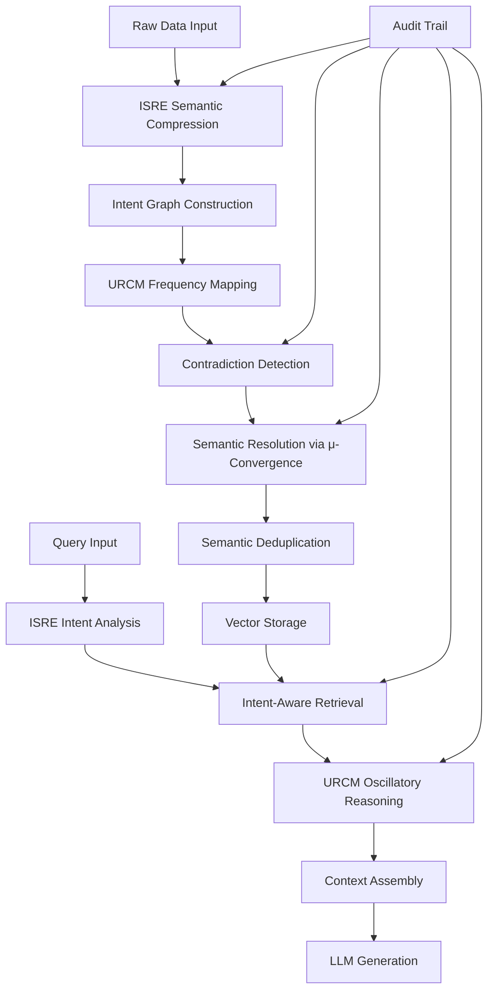

# Design Document: SCDL-RAG Enhanced Architecture

## Overview

The SCDL-RAG Enhanced Architecture is a sophisticated contradiction-aware retrieval system that fundamentally reimagines how knowledge is processed, stored, and retrieved for AI applications. By integrating ISRE (Intentional Semantic Reasoning Engine) and URCM (Unified μ-Resonance Cognitive Mesh), the system addresses the critical limitation of traditional RAG systems: the retrieval of similar but semantically inconsistent content.

The architecture follows a pipeline approach where raw data undergoes semantic compression, frequency mapping, contradiction detection and resolution, before being stored as distilled semantic units. During retrieval, the system employs intent-aware matching and oscillatory reasoning to assemble coherent, contradiction-free context for LLM consumption.

Key innovations include:
- Pre-linguistic semantic processing that transcends language barriers
- Non-probabilistic contradiction resolution using μ-convergence dynamics
- Intent-based retrieval that prioritizes semantic consistency over surface similarity
- Deterministic, auditable decision-making processes
- Semantic deduplication for storage efficiency

## Architecture

The SCDL-RAG system follows a modular, pipeline-based architecture with clear separation of concerns:



### Core Components

1. **ISRE Processing Layer**: Handles semantic compression and intent graph construction
2. **URCM Reasoning Layer**: Manages oscillatory reasoning and μ-convergence dynamics
3. **Storage Layer**: Manages vector storage and semantic deduplication
4. **Retrieval Layer**: Implements intent-aware retrieval and context assembly
5. **API Layer**: Provides RESTful interfaces for system integration
6. **Audit Layer**: Maintains traceability and explainability throughout the pipeline

## Components and Interfaces

### ISRE (Intentional Semantic Reasoning Engine)

The ISRE component serves as the entry point for all content processing, providing language-agnostic semantic compression and intent extraction.

**Core Interfaces:**
```typescript
interface ISREProcessor {
  compressSemantics(rawData: RawContent): SemanticRepresentation
  constructIntentGraph(semantics: SemanticRepresentation): IntentGraph
  analyzeQueryIntent(query: string): QueryIntent
  traceToSource(semanticUnit: SemanticUnit): SourceReference[]
}

interface SemanticRepresentation {
  id: string
  semanticVector: number[]
  intentNodes: IntentNode[]
  sourceReferences: SourceReference[]
  compressionRatio: number
  languageAgnosticHash: string
}

interface IntentGraph {
  nodes: IntentNode[]
  edges: SemanticRelation[]
  rootIntent: string
  confidenceScore: number
}
```

**Key Responsibilities:**
- Extract semantic meaning independent of source language
- Construct intent graphs representing semantic relationships
- Maintain traceability to original source content
- Provide consistent semantic representations across languages

### URCM (Unified μ-Resonance Cognitive Mesh)

The URCM component handles oscillatory reasoning and provides non-probabilistic contradiction resolution through μ-convergence dynamics.

**Core Interfaces:**
```typescript
interface URCMProcessor {
  mapToFrequencyDomain(semantics: SemanticRepresentation[]): FrequencyMapping
  detectResonance(mapping: FrequencyMapping): ResonancePattern[]
  applyMicroConvergence(contradictions: Contradiction[]): Resolution[]
  performOscillatoryReasoning(context: SemanticUnit[]): CoherentContext
}

interface FrequencyMapping {
  semanticFrequencies: Map<string, number>
  resonancePatterns: ResonancePattern[]
  convergenceThreshold: number
}

interface Resolution {
  contradictionId: string
  resolvedSemanticUnit: SemanticUnit
  convergenceEvidence: ConvergenceEvidence
  deterministicHash: string
}
```

**Key Responsibilities:**
- Map semantic units to frequency domains for analysis
- Apply μ-convergence dynamics for contradiction resolution
- Ensure deterministic, repeatable resolution decisions
- Perform oscillatory reasoning for context coherence

### Contradiction Detection and Resolution System

This system identifies and resolves semantic contradictions at ingestion time, preventing inconsistent information from entering the knowledge base.

**Core Interfaces:**
```typescript
interface ContradictionDetector {
  detectContradictions(semanticUnits: SemanticUnit[]): Contradiction[]
  analyzeSemanticConsistency(unit1: SemanticUnit, unit2: SemanticUnit): ConsistencyScore
  flagUnresolvableContradictions(contradictions: Contradiction[]): ExpertReviewItem[]
}

interface SemanticResolver {
  resolveContradiction(contradiction: Contradiction): Resolution
  validateResolution(resolution: Resolution): ValidationResult
  generateResolutionExplanation(resolution: Resolution): Explanation
}

interface Contradiction {
  id: string
  conflictingUnits: SemanticUnit[]
  contradictionType: ContradictionType
  severity: number
  resolutionStrategy: ResolutionStrategy
}
```

### Vector Storage and Deduplication System

Manages efficient storage of semantic units with built-in deduplication and optimization capabilities.

**Core Interfaces:**
```typescript
interface VectorStore {
  storeSemanticUnit(unit: SemanticUnit): StorageResult
  retrieveByIntent(intent: QueryIntent): SemanticUnit[]
  deduplicateSemantics(units: SemanticUnit[]): DeduplicationResult
  optimizeStorage(): OptimizationMetrics
}

interface DeduplicationResult {
  originalCount: number
  deduplicatedCount: number
  spaceSavings: number
  mergedUnits: MergedSemanticUnit[]
}

interface MergedSemanticUnit extends SemanticUnit {
  sourceReferences: SourceReference[]
  mergeHistory: MergeOperation[]
  consolidatedSemantics: SemanticRepresentation
}
```

### Intent-Aware Retrieval Engine

Implements sophisticated retrieval that prioritizes semantic consistency and intent alignment over surface similarity.

**Core Interfaces:**
```typescript
interface RetrievalEngine {
  retrieveByIntent(queryIntent: QueryIntent): RetrievalResult
  rankBySemanticConsistency(units: SemanticUnit[]): RankedResult[]
  filterByCoherence(units: SemanticUnit[]): SemanticUnit[]
  explainRetrievalDecision(result: RetrievalResult): RetrievalExplanation
}

interface RetrievalResult {
  semanticUnits: SemanticUnit[]
  intentAlignment: number
  coherenceScore: number
  retrievalStrategy: string
  explanations: RetrievalExplanation[]
}
```

### Context Assembly System

Constructs coherent, contradiction-free context optimized for LLM consumption.

**Core Interfaces:**
```typescript
interface ContextAssembler {
  assembleContext(units: SemanticUnit[]): AssembledContext
  ensureCoherence(context: AssembledContext): CoherenceValidation
  optimizeForLLM(context: AssembledContext): OptimizedContext
  prioritizeByRelevance(units: SemanticUnit[]): SemanticUnit[]
}

interface AssembledContext {
  contextUnits: SemanticUnit[]
  coherenceScore: number
  contradictionFree: boolean
  totalTokens: number
  assemblyStrategy: string
}
```

### Multi-Language Consistency Validation System

Ensures semantic representations maintain consistency across different languages through automated validation and correction mechanisms.

**Core Interfaces:**
```typescript
interface MultiLanguageValidator {
  validateConsistency(representations: Map<string, SemanticRepresentation>): ConsistencyValidation
  detectInconsistencies(langPair: LanguagePair): InconsistencyReport[]
  generateConsistencyMetrics(representations: SemanticRepresentation[]): ConsistencyMetrics
  correctInconsistencies(inconsistencies: InconsistencyReport[]): CorrectionResult[]
}

interface ConsistencyValidation {
  overallConsistency: number
  languagePairScores: Map<LanguagePair, number>
  inconsistencies: InconsistencyReport[]
  validationTimestamp: Date
  thresholdsMet: boolean
}

interface InconsistencyReport {
  id: string
  languagePair: LanguagePair
  inconsistencyType: InconsistencyType
  severity: number
  affectedSemanticUnits: SemanticUnit[]
  suggestedCorrections: Correction[]
}

interface LanguagePair {
  sourceLanguage: string
  targetLanguage: string
  consistencyThreshold: number
  validationStrategy: ValidationStrategy
}
```

**Key Responsibilities:**
- Validate semantic consistency across language representations
- Detect and classify semantic inconsistencies
- Generate quantitative consistency metrics
- Provide automated correction suggestions
- Support configurable consistency thresholds per language pair

### Compression Ratio Optimization System

Dynamically optimizes semantic compression ratios to maximize storage efficiency while maintaining semantic fidelity.

**Core Interfaces:**
```typescript
interface CompressionOptimizer {
  optimizeCompressionRatio(content: RawContent): OptimizedCompression
  analyzeCompressionEfficiency(semanticUnit: SemanticUnit): CompressionAnalysis
  adaptCompressionStrategy(contentType: ContentType, domain: string): CompressionStrategy
  recommendOptimizations(compressionMetrics: CompressionMetrics[]): OptimizationRecommendation[]
}

interface OptimizedCompression {
  originalSize: number
  compressedSize: number
  compressionRatio: number
  qualityScore: number
  optimizationStrategy: CompressionStrategy
  fidelityMetrics: FidelityMetrics
}

interface CompressionAnalysis {
  currentRatio: number
  optimalRatio: number
  qualityImpact: number
  storageEfficiency: number
  recommendedAdjustments: CompressionAdjustment[]
}

interface CompressionStrategy {
  strategyName: string
  parameters: Map<string, number>
  qualityThreshold: number
  adaptiveEnabled: boolean
  contentTypeSpecific: boolean
}

interface FidelityMetrics {
  semanticPreservation: number
  intentClarity: number
  informationLoss: number
  reconstructionAccuracy: number
}
```

**Key Responsibilities:**
- Dynamically optimize compression ratios based on content characteristics
- Maintain semantic fidelity above configurable quality thresholds
- Provide compression metrics and optimization recommendations
- Support adaptive compression strategies for different content types
- Automatically adjust compression parameters when ratios are suboptimal

## Data Models

### Core Data Structures

```typescript
interface SemanticUnit {
  id: string
  semanticHash: string
  content: string
  semanticVector: number[]
  intentSignature: string
  sourceReferences: SourceReference[]
  processingMetadata: ProcessingMetadata
  qualityMetrics: QualityMetrics
}

interface SourceReference {
  sourceId: string
  documentPath: string
  contentRange: ContentRange
  extractionTimestamp: Date
  originalLanguage: string
  confidence: number
}

interface ProcessingMetadata {
  isreVersion: string
  urcmVersion: string
  processingTimestamp: Date
  compressionRatio: number
  contradictionResolved: boolean
  resolutionHistory: ResolutionRecord[]
}

interface QualityMetrics {
  semanticConsistency: number
  intentClarity: number
  sourceReliability: number
  contradictionRisk: number
}
```

### Intent and Reasoning Models

```typescript
interface IntentNode {
  id: string
  intentType: IntentType
  semanticWeight: number
  relationshipStrength: number
  contextualRelevance: number
}

interface QueryIntent {
  primaryIntent: string
  secondaryIntents: string[]
  intentVector: number[]
  contextualConstraints: Constraint[]
  expectedResponseType: ResponseType
}

interface ResonancePattern {
  frequency: number
  amplitude: number
  phase: number
  harmonics: number[]
  convergenceIndicator: number
}
```

### Audit and Traceability Models

```typescript
interface AuditRecord {
  operationId: string
  operationType: OperationType
  timestamp: Date
  inputData: any
  outputData: any
  processingDecisions: Decision[]
  performanceMetrics: PerformanceMetrics
}

interface Decision {
  decisionPoint: string
  algorithm: string
  parameters: Map<string, any>
  reasoning: string
  confidence: number
  alternatives: Alternative[]
}

interface ExplanationContext {
  decisionChain: Decision[]
  sourceTraceability: SourceReference[]
  semanticJustification: string
  contradictionResolution: Resolution[]
  qualityAssurance: QualityCheck[]
}
```

## Correctness Properties

*A property is a characteristic or behavior that should hold true across all valid executions of a system—essentially, a formal statement about what the system should do. Properties serve as the bridge between human-readable specifications and machine-verifiable correctness guarantees.*

Based on the prework analysis and property reflection to eliminate redundancy, the following properties capture the essential correctness requirements for the SCDL-RAG system:

### Property 1: Language-Agnostic Semantic Consistency
*For any* content with equivalent semantic meaning across different languages, ISRE should produce semantically equivalent representations regardless of source language
**Validates: Requirements 1.1, 1.3**

### Property 2: Semantic Compression Round-Trip Integrity
*For any* semantic compression operation, the essential meaning and intent should be preserved and traceable back to the original source content
**Validates: Requirements 1.4, 1.5**

### Property 3: Intent Graph Construction Completeness
*For any* valid semantic representation, ISRE should construct a well-formed intent graph with proper node and edge relationships
**Validates: Requirements 1.2**

### Property 4: URCM Deterministic Resolution
*For any* identical set of semantic contradictions, URCM should produce identical resolution outcomes using μ-convergence dynamics
**Validates: Requirements 2.1, 2.2, 2.3**

### Property 5: Frequency Domain Mapping Consistency
*For any* set of semantic units, URCM should consistently map them to frequency domains for oscillatory analysis
**Validates: Requirements 2.4**

### Property 6: Contradiction Detection and Resolution Completeness
*For any* set of semantic units containing contradictions, the system should detect all contradictions and resolve them to produce contradiction-free output, or flag unresolvable ones for expert review
**Validates: Requirements 2.5, 3.1, 3.2, 3.3, 3.5, 6.3**

### Property 7: Semantic-Level Contradiction Detection
*For any* content with identical semantic meaning but different surface text, contradiction detection should operate on semantic representations rather than surface text
**Validates: Requirements 3.4**

### Property 8: Intent-Aware Retrieval Consistency
*For any* query, the retrieval engine should analyze intent using ISRE, retrieve semantically consistent units that match the intent, and prioritize semantic consistency over surface similarity
**Validates: Requirements 4.1, 4.2, 4.3, 4.4**

### Property 9: Intent-Based Ranking Correctness
*For any* set of multiple relevant semantic units, ranking should be ordered by intent alignment strength
**Validates: Requirements 4.5**

### Property 10: Semantic Deduplication with Traceability Preservation
*For any* semantically duplicate content, the system should identify duplicates, merge them while preserving all source references, and maintain semantic unit integrity throughout the process
**Validates: Requirements 5.1, 5.2, 5.4, 5.5**

### Property 11: Storage Optimization Effectiveness
*For any* storage operation, the system should optimize for space efficiency while maintaining retrieval performance
**Validates: Requirements 5.3**

### Property 12: Context Assembly Coherence
*For any* set of retrieved semantic units, the context assembler should produce coherent, contradiction-free context optimized for LLM consumption using URCM oscillatory reasoning
**Validates: Requirements 6.1, 6.2, 6.4**

### Property 13: Context Size Management
*For any* context that exceeds size limits, prioritization should be based on semantic relevance to maintain the most important information
**Validates: Requirements 6.5**

### Property 14: Comprehensive Audit Trail Maintenance
*For any* system operation (semantic processing, contradiction resolution, retrieval decisions), complete audit trails with reasoning and evidence should be maintained and traceable back to original sources
**Validates: Requirements 7.1, 7.2, 7.3, 7.4, 7.5**

### Property 15: API Response Structure Consistency
*For any* API call, the system should return properly structured responses with appropriate error handling
**Validates: Requirements 8.3**

### Property 17: Multi-Language Consistency Validation
*For any* content processed in multiple languages, the system should validate semantic consistency across language representations and flag inconsistencies that exceed configurable thresholds
**Validates: Requirements 10.1, 10.2, 10.3, 10.4, 10.5**

### Property 18: Compression Ratio Optimization Effectiveness
*For any* semantic compression operation, the system should dynamically optimize compression ratios based on content characteristics while maintaining semantic fidelity above quality thresholds
**Validates: Requirements 11.1, 11.2, 11.3, 11.4, 11.5**

### Property 16: Configuration Validation and Application
*For any* configuration parameter change, the system should validate parameters for consistency and apply valid changes without restart when possible
**Validates: Requirements 12.4, 12.5**

## Error Handling

The SCDL-RAG system implements comprehensive error handling across all components:

### ISRE Error Handling
- **Malformed Input**: Invalid or corrupted content triggers graceful degradation with detailed error reporting
- **Language Detection Failures**: Fallback to universal semantic processing when language identification fails
- **Semantic Extraction Failures**: Partial extraction with confidence scoring when complete extraction is impossible
- **Intent Graph Construction Errors**: Simplified graph construction with reduced complexity when full construction fails

### URCM Error Handling
- **Convergence Failures**: Timeout mechanisms with partial resolution when μ-convergence cannot be achieved
- **Frequency Mapping Errors**: Alternative mapping strategies when primary frequency analysis fails
- **Oscillatory Reasoning Failures**: Fallback to deterministic resolution when oscillatory methods fail
- **Resource Exhaustion**: Graceful degradation with reduced precision when computational resources are limited

### Storage and Retrieval Error Handling
- **Storage Failures**: Redundant storage with automatic failover and data integrity verification
- **Retrieval Timeouts**: Progressive timeout handling with partial results when full retrieval is delayed
- **Deduplication Conflicts**: Conservative merging with manual review triggers when automatic resolution is uncertain
- **Index Corruption**: Automatic index rebuilding with minimal service disruption

### System-Level Error Handling
- **Component Failures**: Circuit breaker patterns with automatic component isolation and recovery
- **Network Partitions**: Eventual consistency mechanisms with conflict resolution upon reconnection
- **Configuration Errors**: Validation with rollback capabilities and safe default configurations
- **Audit Trail Failures**: Redundant logging with integrity verification and recovery mechanisms

## Testing Strategy

The SCDL-RAG system employs a comprehensive dual testing approach combining unit tests for specific scenarios and property-based tests for universal correctness validation.

### Property-Based Testing Framework

**Framework Selection**: The system uses Hypothesis (Python) for property-based testing, configured to run a minimum of 100 iterations per property test to ensure comprehensive input coverage through randomization.

**Property Test Configuration**:
- Each correctness property is implemented as a single property-based test
- Tests are tagged with format: **Feature: scdl-rag-enhanced-architecture, Property {number}: {property_text}**
- Custom generators create realistic semantic units, intent graphs, and contradiction scenarios
- Shrinking strategies help identify minimal failing cases for debugging

**Key Property Test Categories**:

1. **Semantic Consistency Properties** (Properties 1, 2, 7)
   - Generate multilingual content with equivalent semantics
   - Test compression and decompression round-trips
   - Verify semantic-level operation independence from surface text

2. **Determinism Properties** (Properties 4, 5)
   - Generate identical contradiction sets multiple times
   - Verify identical resolution outcomes across runs
   - Test frequency mapping consistency

3. **Completeness Properties** (Properties 3, 6, 14)
   - Generate various semantic representations and verify intent graph construction
   - Create contradiction scenarios and verify complete detection and resolution
   - Test audit trail completeness across all operations

4. **Optimization Properties** (Properties 10, 11, 13)
   - Generate duplicate content and verify deduplication effectiveness
   - Test storage optimization metrics
   - Verify context prioritization under size constraints

### Unit Testing Strategy

**Complementary Coverage**: Unit tests focus on specific examples, edge cases, and integration points that property tests cannot easily cover:

- **Component Integration**: Test interfaces between ISRE, URCM, and storage layers
- **Error Conditions**: Specific error scenarios like malformed input, network failures, and resource exhaustion
- **Configuration Edge Cases**: Boundary conditions for configuration parameters
- **API Contract Validation**: Specific API request/response scenarios
- **Performance Benchmarks**: Baseline performance measurements for regression detection

**Testing Balance**:
- Property tests handle comprehensive input coverage and universal correctness
- Unit tests focus on specific scenarios, error conditions, and integration validation
- Integration tests verify end-to-end workflows and system behavior
- Performance tests validate scalability and response time requirements

### Test Data Management

**Synthetic Data Generation**:
- Multilingual content generators for semantic consistency testing
- Contradiction scenario generators for resolution testing
- Large-scale data generators for performance and scalability testing
- Domain-specific content generators for customization testing

**Test Environment Management**:
- Isolated test environments for each component
- Shared integration environment for end-to-end testing
- Performance testing environment with production-like data volumes
- Staging environment for user acceptance validation

### Continuous Testing Integration

**Automated Test Execution**:
- Property tests run on every commit with full 100-iteration cycles
- Unit tests provide rapid feedback in development cycles
- Integration tests run on pull requests and releases
- Performance tests run nightly with trend analysis

**Quality Gates**:
- All property tests must pass before code integration
- Unit test coverage maintained above 90% for core components
- Integration test success required for release candidates
- Performance regression detection with automatic alerts