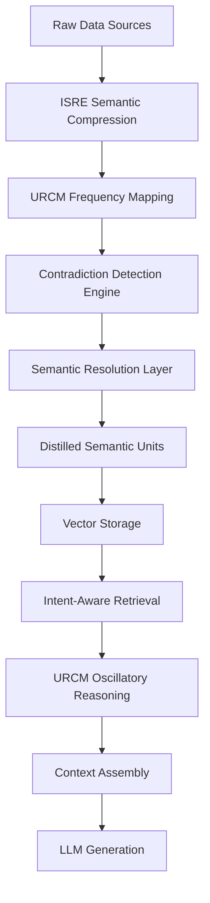

# SCDL-RAG Enhanced Architecture
## Contradiction-Aware Retrieval with URCM & ISRE Integration

### Core SCDL-RAG Pipeline (Enhanced)



## Enhanced Components

### 1. ISRE-Powered Semantic Parsing
**Purpose**: Replace basic semantic parsing with proven intent-based extraction

**Integration Points**:
- **Pre-Linguistic Compression**: Extract language-agnostic semantic primitives
- **Intent Graph Construction**: Build structured representations of document meanings
- **Conflict Detection**: Use intent graphs to identify semantic contradictions

**Benefits for SCDL-RAG**:
- More accurate contradiction detection through intent analysis
- Language-agnostic processing reduces redundancy across languages
- Structured semantic representation improves resolution quality

### 2. URCM-Enhanced Contradiction Resolution
**Purpose**: Use oscillatory dynamics for sophisticated conflict resolution

**Integration Points**:
- **μ-Convergence**: Apply μ-stability metrics to choose between conflicting claims
- **Oscillatory Gating**: Use temporal dynamics to prevent bias in resolution
- **Attractor Networks**: Represent stable semantic meanings as attractors

**Benefits for SCDL-RAG**:
- Non-probabilistic resolution (no averaging of contradictions)
- Automatic termination when resolution converges
- Stable, repeatable resolution decisions

### 3. Enhanced Retrieval with Oscillatory Reasoning
**Purpose**: Use URCM reasoning for intent-aware retrieval

**Integration Points**:
- **Intent Recognition**: Parse user queries through ISRE semantic compression
- **Resonance Matching**: Match query resonance with document resonance states
- **Competitive Selection**: Use oscillatory dynamics to select context

**Benefits for SCDL-RAG**:
- Retrieval based on semantic intent, not just similarity
- Dynamic context assembly based on reasoning needs
- Reduced hallucination through coherent context selection

## Enhanced Data Flow

### Ingestion Phase (ISRE + URCM Enhanced)
```
Raw Documents 
  → ISRE Semantic Compression (language-agnostic primitives)
  → URCM Frequency Mapping (resonance states)
  → Intent Graph Analysis (structured meanings)
  → Contradiction Detection (intent conflicts)
  → μ-Convergence Resolution (stable resolution)
  → Distilled Semantic Units (DSUs)
  → Vector Storage
```

### Retrieval Phase (URCM Enhanced)
```
User Query
  → ISRE Intent Extraction (query semantics)
  → URCM Resonance Encoding (query resonance state)
  → Oscillatory Retrieval (resonance matching)
  → Competitive Context Selection (semantic fit)
  → Context Assembly
  → LLM Generation
```

## Key Enhancements Over Basic SCDL-RAG

### 1. Sophisticated Contradiction Resolution
- **Basic SCDL**: Simple temporal/confidence weighting
- **Enhanced**: μ-convergence dynamics with oscillatory stability
- **Result**: More nuanced, stable resolution decisions

### 2. Intent-Aware Processing
- **Basic SCDL**: Keyword-based similarity
- **Enhanced**: Deep semantic intent understanding
- **Result**: Better retrieval relevance and context quality

### 3. Language-Agnostic Operation
- **Basic SCDL**: Language-dependent processing
- **Enhanced**: Pre-linguistic semantic extraction
- **Result**: Unified processing across languages, reduced redundancy

### 4. Deterministic Reasoning
- **Basic SCDL**: Probabilistic conflict resolution
- **Enhanced**: Deterministic oscillatory dynamics
- **Result**: Repeatable, explainable resolution decisions

## Implementation Architecture

### Core Classes Integration
```python
class EnhancedSCDLRAG:
    def __init__(self):
        self.isre_compressor = ISRESemanticCompressor()
        self.urcm_processor = URCMResonanceProcessor()
        self.contradiction_engine = ContradictionEngine()
        self.resolution_engine = MuConvergenceResolver()
        
    def ingest_document(self, document: str) -> DistilledSemanticUnit:
        # ISRE semantic extraction
        semantic_primitives = self.isre_compressor.compress(document)
        
        # URCM resonance encoding
        resonance_state = self.urcm_processor.encode(semantic_primitives)
        
        # Enhanced contradiction detection
        conflicts = self.contradiction_engine.detect_conflicts(resonance_state)
        
        # μ-convergence resolution
        resolved_state = self.resolution_engine.resolve(conflicts)
        
        return DistilledSemanticUnit(resolved_state)
        
    def retrieve_context(self, query: str) -> List[DistilledSemanticUnit]:
        # ISRE query intent extraction
        query_intent = self.isre_compressor.extract_intent(query)
        
        # URCM oscillatory retrieval
        resonance_matches = self.urcm_processor.oscillatory_match(query_intent)
        
        # Competitive context selection
        return self.select_best_context(resonance_matches)
```

## Benefits of Integration

### For Enterprises
- **Proven Components**: URCM and ISRE are tested architectures
- **Enhanced Quality**: Better contradiction resolution and retrieval
- **Reduced Risk**: Building on validated designs
- **Explainable AI**: Deterministic reasoning with clear traceability

### For Performance
- **Storage Efficiency**: ISRE compression + SCDL deduplication
- **Retrieval Quality**: Intent-aware matching reduces noise
- **Resolution Stability**: μ-convergence prevents oscillating decisions
- **Scalability**: Decentralized URCM mesh for large deployments

### For Development
- **Modular Design**: Each component can be developed/tested independently
- **Clear Interfaces**: Well-defined integration points
- **Incremental Deployment**: Can deploy basic SCDL first, add enhancements later
- **Proven Testing**: Property-based testing frameworks already defined

## Positioning Statement

**SCDL-RAG Enhanced**: A contradiction-aware retrieval architecture that combines proven semantic reasoning (ISRE) and oscillatory dynamics (URCM) to deliver enterprise-grade knowledge distillation and intent-aware retrieval for reliable AI systems.

This positions SCDL-RAG as the commercial product with URCM and ISRE as the proven technological differentiators that make it more effective than basic RAG systems.