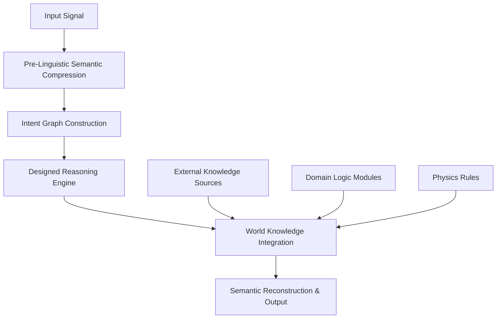

# Design Document: Intentional Semantic Reasoning Engine (ISRE)

## Overview

The Intentional Semantic Reasoning Engine (ISRE) represents a paradigm shift from token-based language models to a pre-linguistic reasoning system. Unlike traditional AI systems that perform statistical next-token prediction, ISRE operates on semantic primitives extracted before language processing, uses structured intent graphs for explicit reasoning, and employs oscillatory competitive dynamics to resolve intent conflicts.

The system architecture consists of five tightly integrated layers that form a single reasoning pipeline: semantic compression, intent graph construction, designed reasoning engine, world knowledge integration, and semantic reconstruction. This design enables deterministic, inspectable, and intentional reasoning that treats language as merely an interface rather than the core reasoning mechanism.

## Architecture

The ISRE follows a linear pipeline architecture with five distinct processing layers:



### Layer Interactions

Each layer maintains semantic consistency while transforming representations:
- **Layer 1 → 2**: Semantic primitives feed into intent graph nodes
- **Layer 2 → 3**: Intent graphs provide structured input for reasoning paths
- **Layer 3 → 4**: Reasoning decisions trigger knowledge queries
- **Layer 4 → 5**: Enriched semantic decisions drive output reconstruction

## Components and Interfaces

### 1. Pre-Linguistic Semantic Compression Layer

**Purpose**: Convert any input modality into language-agnostic semantic primitives.

**Core Components**:
- **Phoneme Extractor**: Processes speech input into phonemic representations
- **Concept Mapper**: Maps textual concepts to semantic primitives
- **Multimodal Processor**: Handles sensor data, symbols, and other input types
- **Deterministic Compressor**: Ensures identical inputs produce identical semantic forms

**Key Algorithms**:
- Frequency-based semantic generalization using domain dictionaries
- Hypernym replacement for lexical compression while preserving meaning
- Cross-linguistic semantic alignment for language-agnostic processing

**Interface**:
```
Input: Raw data (text, speech, symbols, sensor data)
Output: SemanticPrimitive[] - array of meaning-bearing units
Properties: Deterministic, language-agnostic, lossy compression
```

### 2. Intent Graph Construction Layer

**Purpose**: Transform semantic primitives into structured, inspectable intent representations.

**Core Components**:
- **Node Generator**: Creates intent nodes (goal, context, query, constraint, emotion)
- **Edge Constructor**: Establishes causal, temporal, logical, and priority relationships
- **Conflict Detector**: Identifies and represents intent conflicts explicitly
- **Graph Optimizer**: Ensures graph structure supports efficient reasoning

**Graph Structure**:
- **Nodes**: Typed intent units with semantic payloads
- **Edges**: Weighted, directed relationships with semantic labels
- **Subgraphs**: Hierarchical intent clusters for complex reasoning

**Interface**:
```
Input: SemanticPrimitive[]
Output: IntentGraph - structured graph with nodes and edges
Properties: Inspectable, modifiable, conflict-aware
```

### 3. Designed Reasoning Engine

**Purpose**: Perform intentional reasoning using competitive, oscillatory dynamics.

**Core Components**:

#### Multi-Path Reasoning Generator
- **Path Generator**: Creates multiple parallel reasoning strategies
- **Constraint Checker**: Validates paths against logical and domain constraints
- **Coherence Evaluator**: Measures semantic consistency of reasoning paths

#### Oscillatory Gating Mechanism
- **Activation Controller**: Manages path activation/deactivation cycles
- **Attention Oscillator**: Implements cognitive attention-like cycles
- **Convergence Monitor**: Ensures finite-time decision convergence

#### Competitive Selection System
- **Intent Satisfaction Scorer**: Measures how well paths satisfy original intents
- **Constraint Compliance Checker**: Evaluates adherence to logical constraints
- **Semantic Coherence Evaluator**: Assesses internal consistency of reasoning

**Key Algorithms**:
- Hopf oscillator dynamics for path gating
- Competitive winner-take-all with oscillatory modulation
- Multi-objective optimization for path selection

**Interface**:
```
Input: IntentGraph
Output: ReasoningDecision - selected path with justification
Properties: Non-probabilistic, oscillatory, competitive
```

### 4. World Knowledge Integration Layer

**Purpose**: Provide external knowledge access without embedding knowledge in weights.

**Core Components**:
- **Knowledge Query Engine**: Interfaces with external structured knowledge
- **Physics Rule Engine**: Applies physical constraints and laws
- **Domain Logic Manager**: Loads and executes domain-specific reasoning modules
- **Knowledge Gap Detector**: Identifies missing information explicitly

**Knowledge Sources**:
- Structured databases (scientific facts, domain knowledge)
- Physics simulation engines
- Logical constraint systems
- Pluggable domain-specific modules

**Interface**:
```
Input: ReasoningDecision + knowledge queries
Output: EnrichedDecision - decision with external knowledge
Properties: Dynamic querying, explicit gap identification, modular
```

### 5. Semantic Reconstruction Layer

**Purpose**: Convert semantic decisions back into natural language or executable actions.

**Core Components**:
- **Language Generator**: Produces natural language from semantic decisions
- **Code Generator**: Creates executable code from semantic specifications
- **Action Planner**: Converts decisions into action sequences
- **Multi-Format Translator**: Supports multiple output modalities

**Translation Strategies**:
- Template-based generation for structured outputs
- Neural language models for natural language (post-reasoning only)
- Domain-specific formatters for specialized outputs

**Interface**:
```
Input: EnrichedDecision
Output: FormattedOutput - language, code, or actions
Properties: Multi-format, translation-based, post-reasoning
```

## Data Models

### Core Data Structures

#### SemanticPrimitive
```
{
  id: string,
  concept: string,
  semantic_weight: float,
  modality: InputModality,
  compression_metadata: CompressionInfo
}
```

#### IntentNode
```
{
  id: string,
  type: IntentType, // goal, context, query, constraint, emotion
  semantic_payload: SemanticPrimitive[],
  activation_level: float,
  conflict_markers: ConflictInfo[]
}
```

#### IntentEdge
```
{
  source_id: string,
  target_id: string,
  relationship_type: RelationType, // causal, temporal, logical, priority
  weight: float,
  semantic_label: string
}
```

#### ReasoningPath
```
{
  id: string,
  steps: ReasoningStep[],
  intent_satisfaction_score: float,
  constraint_compliance_score: float,
  semantic_coherence_score: float,
  oscillation_state: OscillationState
}
```

#### ReasoningDecision
```
{
  selected_path: ReasoningPath,
  justification: string,
  confidence: float,
  alternative_paths: ReasoningPath[],
  convergence_metadata: ConvergenceInfo
}
```

### State Management

The system maintains several critical state components:

- **Semantic State**: Current semantic primitives and their relationships
- **Intent State**: Active intent graph with current node activations
- **Reasoning State**: Active reasoning paths and their oscillation phases
- **Knowledge State**: Cached external knowledge and query history
- **Output State**: Generated outputs and their semantic mappings

## Correctness Properties

*A property is a characteristic or behavior that should hold true across all valid executions of a system—essentially, a formal statement about what the system should do. Properties serve as the bridge between human-readable specifications and machine-verifiable correctness guarantees.*

Before writing the correctness properties, I need to analyze the acceptance criteria from the requirements document to determine which ones are testable as properties.

Based on the prework analysis, I've identified the testable acceptance criteria and consolidated redundant properties. Here are the core correctness properties:

### Property 1: Cross-Language Semantic Consistency
*For any* semantic meaning expressed in different languages, the Semantic_Compressor should produce identical semantic primitives, ensuring language-agnostic processing.
**Validates: Requirements 1.3**

### Property 2: Semantic Compression Determinism  
*For any* input provided multiple times, the system should produce semantically equivalent outputs, ensuring consistent and reliable reasoning.
**Validates: Requirements 1.4, 7.1**

### Property 3: Grammar-Free Semantic Extraction
*For any* semantic meaning expressed with different grammatical structures, the Semantic_Compressor should produce equivalent semantic primitives, removing linguistic bias.
**Validates: Requirements 1.2**

### Property 4: Intent Graph Completeness
*For any* set of semantic primitives, the constructed Intent_Graph should contain all required node types (goal, context, query, constraint) and edge types (causal, temporal, logical, priority).
**Validates: Requirements 2.2, 2.3**

### Property 5: Conflict Explicit Representation
*For any* input containing conflicting intents, the Intent_Graph should explicitly represent these conflicts as identifiable graph structures.
**Validates: Requirements 2.4**

### Property 6: Multi-Path Reasoning Generation
*For any* Intent_Graph, the Reasoning_Engine should generate multiple distinct reasoning paths rather than a single path.
**Validates: Requirements 3.1**

### Property 7: Competitive Path Selection
*For any* set of reasoning paths, the system should select paths based on intent satisfaction, constraint compliance, and semantic coherence scores.
**Validates: Requirements 3.2**

### Property 8: Oscillatory Path Dynamics
*For any* reasoning session, paths should exhibit activation/deactivation cycles over time while maintaining diversity and preventing collapse to single biased paths.
**Validates: Requirements 3.3, 3.4**

### Property 9: Non-Token Reasoning
*For any* reasoning process, the Reasoning_Engine should not perform token prediction operations, maintaining separation from language-based processing.
**Validates: Requirements 3.6**

### Property 10: External Knowledge Integration
*For any* reasoning decision requiring external knowledge, the system should query appropriate external sources and integrate physics rules, logical constraints, and domain-specific modules.
**Validates: Requirements 4.1, 4.2**

### Property 11: Knowledge Gap Detection
*For any* reasoning scenario with missing knowledge, the system should explicitly identify and report the knowledge gaps.
**Validates: Requirements 4.3**

### Property 12: Architectural Layer Separation
*For any* processing request, the system should maintain clear separation between reasoning/knowledge storage and reasoning/output generation phases.
**Validates: Requirements 4.4, 5.4**

### Property 13: Multi-Format Output Consistency
*For any* semantic decision, the Output_Reconstructor should be able to express it in multiple formats (language, code, actions) while maintaining semantic equivalence.
**Validates: Requirements 5.2, 5.3**

### Property 14: Translation-Based Output Generation
*For any* output generation process, the system should translate completed semantic decisions rather than perform reasoning during generation.
**Validates: Requirements 5.5**

### Property 15: Sequential Pipeline Processing
*For any* input, the system should process it through all five layers in the specified sequence: Input → Compression → Intent Graph → Reasoning → Output.
**Validates: Requirements 6.1**

### Property 16: Semantic Consistency Preservation
*For any* input processed through the pipeline, semantic meaning should be preserved from input to output across all layers.
**Validates: Requirements 6.3**

### Property 17: Processing Traceability
*For any* completed processing request, the system should provide complete traceability from input through reasoning to output.
**Validates: Requirements 6.4**

### Property 18: Oscillatory Convergence
*For any* reasoning session with oscillatory paths, the system should converge to a decision within finite time.
**Validates: Requirements 7.3**

### Property 19: Concurrent Request Isolation
*For any* set of concurrent reasoning requests, each request should be processed without interference from others.
**Validates: Requirements 7.4**

### Property 20: Graceful Resource Degradation
*For any* resource-constrained scenario, the system should maintain correctness while gracefully degrading performance.
**Validates: Requirements 7.5**

### Property 21: Comprehensive System Extensibility
*For any* new functionality requirement (compression methods, reasoning strategies, output formats, knowledge modules), the system should support pluggable module integration.
**Validates: Requirements 8.1, 8.2, 8.3, 8.5**

### Property 22: Intent Graph API Accessibility
*For any* external system requiring Intent_Graph access, the system should provide functional APIs for inspection and modification.
**Validates: Requirements 8.4**

## Error Handling

The ISRE implements comprehensive error handling across all layers:

### Semantic Compression Errors
- **Invalid Input Format**: Return structured error with input type and expected formats
- **Compression Failure**: Provide fallback to basic semantic extraction with warning
- **Cross-Language Mapping Failure**: Report language pair and semantic concepts that failed

### Intent Graph Construction Errors
- **Malformed Semantic Primitives**: Return validation errors with specific primitive issues
- **Graph Construction Failure**: Provide partial graph with error annotations
- **Conflict Detection Errors**: Report unresolvable conflicts with suggested resolutions

### Reasoning Engine Errors
- **Path Generation Failure**: Return error with available partial paths
- **Oscillation Non-Convergence**: Implement timeout with best-effort decision
- **Competitive Selection Failure**: Provide random selection with warning

### Knowledge Integration Errors
- **External Source Unavailable**: Continue with available knowledge and gap markers
- **Knowledge Inconsistency**: Report conflicts and provide resolution strategies
- **Module Loading Failure**: Graceful degradation with error logging

### Output Reconstruction Errors
- **Format Translation Failure**: Provide alternative format with warning
- **Semantic Loss Detection**: Report information loss and suggest alternatives
- **Multi-Format Inconsistency**: Return primary format with consistency warnings

## Testing Strategy

The ISRE requires a dual testing approach combining unit tests for specific scenarios and property-based tests for universal correctness guarantees.

### Property-Based Testing Framework
- **Framework**: Use Hypothesis (Python) or fast-check (TypeScript) for property-based testing
- **Test Configuration**: Minimum 100 iterations per property test to ensure comprehensive coverage
- **Generator Strategy**: Create smart generators that produce semantically meaningful test data
- **Property Annotation**: Each test tagged with format: **Feature: intentional-semantic-reasoning-engine, Property {number}: {property_text}**

### Unit Testing Strategy
- **Specific Examples**: Test concrete scenarios that demonstrate correct behavior
- **Edge Cases**: Focus on boundary conditions, empty inputs, and error scenarios
- **Integration Points**: Verify layer-to-layer communication and data transformation
- **Mock Strategy**: Minimize mocking to test real functionality; use mocks only for external dependencies

### Test Data Generation
- **Semantic Primitives**: Generate diverse semantic concepts across domains
- **Multi-Language Inputs**: Create equivalent meanings in multiple languages
- **Intent Conflicts**: Generate scenarios with competing goals and constraints
- **Knowledge Scenarios**: Create cases requiring external knowledge integration
- **Oscillatory Patterns**: Generate inputs that trigger complex reasoning dynamics

### Performance and Scalability Testing
- **Reasoning Convergence**: Verify finite-time convergence under various conditions
- **Concurrent Processing**: Test system behavior under concurrent load
- **Resource Constraints**: Validate graceful degradation under memory/CPU limits
- **Large-Scale Inputs**: Test system behavior with complex, multi-layered inputs

### Validation Approach
- **Semantic Equivalence**: Develop metrics for measuring semantic similarity
- **Graph Structure Validation**: Verify intent graph completeness and correctness
- **Reasoning Path Quality**: Assess path diversity and selection criteria
- **Output Consistency**: Validate multi-format output equivalence
- **Traceability Verification**: Ensure complete input-to-output traceability

The testing strategy ensures that the ISRE maintains its novel properties while providing reliable, deterministic reasoning capabilities that distinguish it from traditional language models.